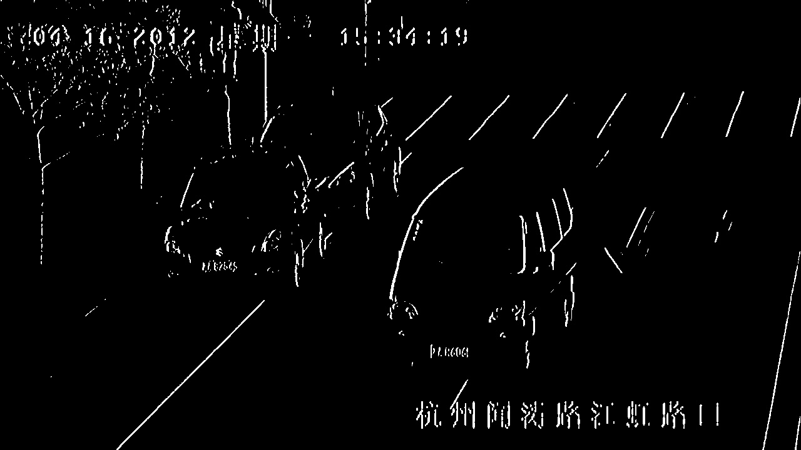
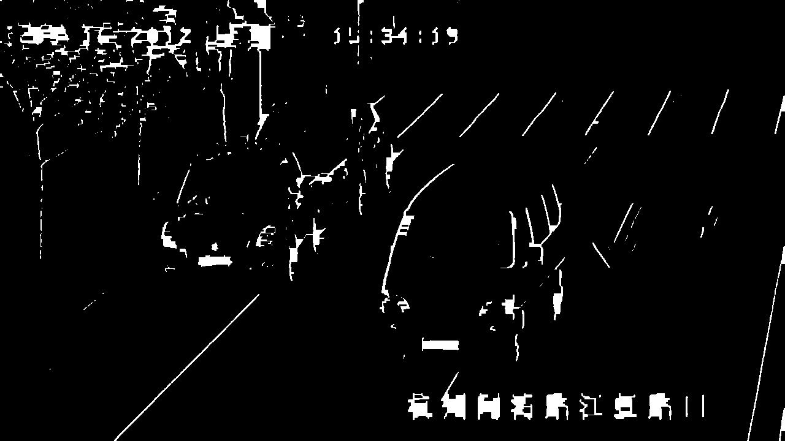

# License_Plate_Detection
Identification of licese plates of vehicles in traffic using Image Processing techniques.

The aim of the project was to detect license plate of all the vehicles moving in traffic in real-time using different image processing techniques. In the implementation a video sample is used for demonstration. Many standard algorithms implemented on OpenCV (Python) library is used in the implementation. There are a few hyper-parameters which determine the accuracy of detection.

Example :
`area_range`
`aspect_ratio_range`
`angle_thresh`
`edge_density_threshold`
You can find these variables in the file [License_plate.py](./License_plate.py)

The code is written in Python3 using OpenCV.</br>

There is a jupyter notebook which demonstrates the image processing and license plate detection algorithm and the file is by name  [detect_a_plate.ipynb](./detect_a_plate.ipynb).

The implementation on a video is done and the code for the same can be found in [License_plate.py](./detect_a_plate.ipynb).

The intermediate image processing steps can be explained using the following images.
</br>

In the first step **vertical features** are identified from the image using Sobel operator.


In the next step, a kernel is run to find the approximate rectangles of defined aspect ratio (a hyperparameter).



Then using the contours the rectangle within the defined aspect ratio range are selected and displayed.

### Steps to run
**Pre-Requisites**
```
Python3
OpenCV
```
**Steps**
```
git clone https://github.com/darshandv/License_Plate_detection.git
python3 License_plate.py
```
